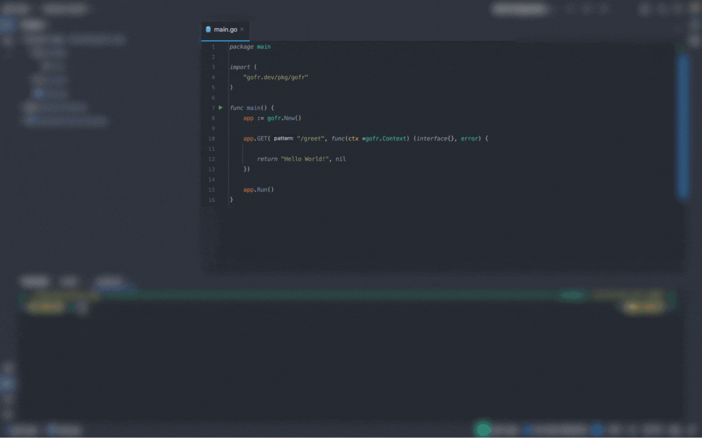

<p align="center">

</p>
<p align="center"><b>
GoFr is an opinionated microservice development framework.</b></p>

<div align=center>
<a href="https://pkg.go.dev/gofr.dev"></a>
<a href="https://gofr.dev/docs"></a>
<a href="https://codeclimate.com/github/gofr-dev/gofr/maintainability"></a>
<a href="https://codeclimate.com/github/gofr-dev/gofr/test_coverage"></a>
<a href="https://goreportcard.com/report/gofr.dev"></a>
<a href="https://opensource.org/licenses/Apache-2.0"></a>
<a href="https://discord.gg/wsaSkQTdgq"></a>
</div>

Listed in [CNCF Landscape](https://landscape.cncf.io/?selected=go-fr).

## 🎯 Goal
Even though generic applications can be written using GoFr, our main focus is to simplify the development of microservices.
We will focus on deployment in Kubernetes and aspire to provide out-of-the-box observability.

## 💡 Key Features

1. Simple API syntax
2. REST Standards by default
3. Configuration management
4. [Observability](https://gofr.dev/docs/quick-start/observability) (Logs, Traces, Metrics)
5. Inbuilt [Auth Middleware](https://gofr.dev/docs/advanced-guide/http-authentication) & Support for [Custom Middleware](https://gofr.dev/docs/advanced-guide/middlewares)
6. [gRPC support](https://gofr.dev/docs/advanced-guide/grpc)
7. [HTTP service](https://gofr.dev/docs/advanced-guide/http-communication) with support for [Circuit Breaker](https://gofr.dev/docs/advanced-guide/circuit-breaker)
8. [Pub/Sub](https://gofr.dev/docs/advanced-guide/using-publisher-subscriber)
9. [Health Check](https://gofr.dev/docs/advanced-guide/monitoring-service-health) by default for all datasources.
10. [Database Migration](https://gofr.dev/docs/advanced-guide/handling-data-migrations)
11. [Cron Jobs](https://gofr.dev/docs/advanced-guide/using-cron)
12. Support for [changing Log Level](https://gofr.dev/docs/advanced-guide/remote-log-level-change) without restarting the application.
13. [Swagger Rendering](https://gofr.dev/docs/advanced-guide/swagger-documentation)
14. [Abstracted File Systems](https://gofr.dev/docs/advanced-guide/handling-file)
15. [Websockets](https://gofr.dev/docs/advanced-guide/handling-file)



## Getting started
### Prerequisites
GoFr requires [Go](https://go.dev/) version [1.21](https://go.dev/doc/devel/release#go1.21.0) or above.

### Getting GoFr
With [Go's module support](https://go.dev/wiki/Modules#how-to-use-modules), `go [build|run|test]` automatically fetches the necessary dependencies when you add the import in your code:

```sh
import "github.com/gofr-dev/gofr"
```

Alternatively, use `go get`:

```sh
go get -u github.com/gofr-dev/gofr
```
### Running GoFr
A basic example:
```go
package main

import "gofr.dev/pkg/gofr"

func main() {
    app := gofr.New()

    app.GET("/greet", func(ctx *gofr.Context) (interface{}, error) {

        return "Hello World!", nil
    })

   app.Run() // listen and serve on localhost:8000 
}
```

To run the code, use the `go run` command, like:

```sh
$ go run main.go
```

Then visit [`localhost:8000/greet`](http://localhost:8000/greet) in your browser to see the response!

### See more examples
A number of ready-to-run examples demonstrating various use cases of GoFr are available in the [GoFr examples](https://github.com/gofr-dev/gofr/tree/development/examples) directory.

## 👩‍💻Documentation
See the  [godocs](https://pkg.go.dev/gofr.dev).

The documentation is also available on  [gofr.dev](https://gofr.dev/docs).

## 👍 Contribute
If you want to say thank you and/or support the active development of GoFr:

1. [Star](https://docs.github.com/en/get-started/exploring-projects-on-github/saving-repositories-with-stars) the repo.
2. Write a review or tutorial on [Medium](https://medium.com/), [Dev.to](https://dev.to/) or personal blog.
3. Visit [CONTRIBUTING](CONTRIBUTING.md) for details on submitting patches and the contribution workflow.

If your PR is merged or you have written an article or contributed in someway to development or spreading the word about GoFr, fill the [Google Form](https://forms.gle/R1Yz7ZzY3U5WWTgy5), and we will send you a <b>GoFr T-Shirt and Stickers</b> as a token of appreciation.
