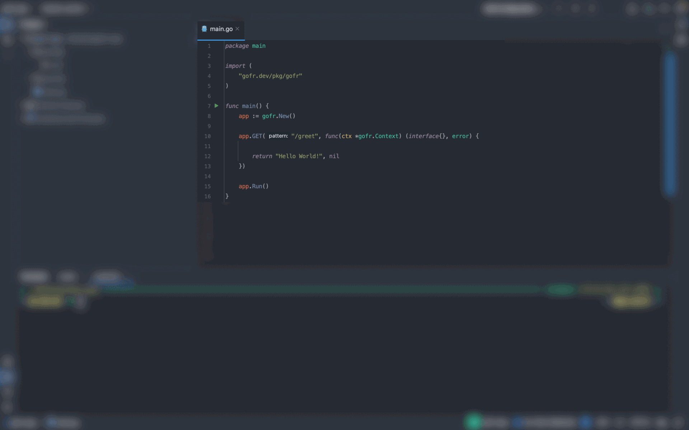

Here's the improved version of your README file, with more visual organization, emphasis on key points, and polished formatting for clarity. I've maintained all original details while enhancing the look and feel:

---

<p align="center">

</p>

<h1 align="center"><b>GoFr: An Opinionated Microservice Development Framework</b></h1>

<div align="center">
<a href="https://pkg.go.dev/gofr.dev"></a>
<a href="https://gofr.dev/docs"></a>
<a href="https://codeclimate.com/github/gofr-dev/gofr/maintainability"></a>
<a href="https://codeclimate.com/github/gofr-dev/gofr/test_coverage"></a>
<a href="https://goreportcard.com/report/gofr.dev"></a>
<a href="https://opensource.org/licenses/Apache-2.0"></a>
<a href="https://discord.gg/wsaSkQTdgq"></a>
</div>

---

<h2 align="center">Listed in the <a href="https://landscape.cncf.io/?selected=go-fr">CNCF Landscape</a></h2>

---

## 🎯 **Goal**
GoFr is built to simplify **microservice development** with a focus on **Kubernetes** deployment and **out-of-the-box observability**. While it can handle generic applications, microservices remain the core focus.

---

## 💡 **Key Features**

1. **Simple API Syntax**
2. **REST Standards by Default**
3. **Configuration Management**
4. **[Observability](https://gofr.dev/docs/quick-start/observability)** (Logs, Traces, Metrics)
5. **Inbuilt [Auth Middleware](https://gofr.dev/docs/advanced-guide/http-authentication)** & Support for [Custom Middleware](https://gofr.dev/docs/advanced-guide/middlewares)
6. **[gRPC Support](https://gofr.dev/docs/advanced-guide/grpc)**
7. **[HTTP Service](https://gofr.dev/docs/advanced-guide/http-communication)** with support for [Circuit Breaker](https://gofr.dev/docs/advanced-guide/circuit-breaker)
8. **[Pub/Sub](https://gofr.dev/docs/advanced-guide/using-publisher-subscriber)**
9. **[Health Check](https://gofr.dev/docs/advanced-guide/monitoring-service-health)** for all datasources
10. **[Database Migration](https://gofr.dev/docs/advanced-guide/handling-data-migrations)**
11. **[Cron Jobs](https://gofr.dev/docs/advanced-guide/using-cron)**
12. **Support for [Changing Log Level](https://gofr.dev/docs/advanced-guide/remote-log-level-change) Without Restarting**
13. **[Swagger Rendering](https://gofr.dev/docs/advanced-guide/swagger-documentation)**
14. **[Abstracted File Systems](https://gofr.dev/docs/advanced-guide/handling-file)**
15. **[Websockets](https://gofr.dev/docs/advanced-guide/handling-file)**

---



---

## 🚀 **Getting Started**

### **Prerequisites**

- GoFr requires **[Go](https://go.dev/)** version **[1.21](https://go.dev/doc/devel/release#go1.21.0)** or above.

### **Installation**

With Go's module support, the `go [build|run|test]` command will fetch all necessary dependencies automatically when you add the following import to your code:

```go
import "gofr.dev/pkg/gofr"
```

Alternatively, you can use:

```bash
go get -u gofr.dev/pkg/gofr
```

---

## 🏃 **Running GoFr**

Here’s a basic example of how to run a GoFr application:

```go
package main

import "gofr.dev/pkg/gofr"

func main() {
    app := gofr.New()

    app.GET("/greet", func(ctx *gofr.Context) (interface{}, error) {
        return "Hello World!", nil
    })

    app.Run() // listen and serve on localhost:8000 
}
```

Run the code with:

```bash
$ go run main.go
```

Then, visit [`localhost:8000/greet`](http://localhost:8000/greet) in your browser to see the response!

---

## 📂 **See More Examples**

Explore more ready-to-run examples in the [GoFr examples directory](https://github.com/gofr-dev/gofr/tree/development/examples).

---

## 👩‍💻 **Documentation**

- See the **[godocs](https://pkg.go.dev/gofr.dev)** for complete API documentation.
- For additional resources, visit the official **[GoFr documentation](https://gofr.dev/docs)**.

---

## 👍 **Contribute**

There are several ways you can contribute to GoFr and support its development:

1. **Star** this repository on GitHub! 🌟
2. Write a review or tutorial on platforms like **[Medium](https://medium.com/)**, **[Dev.to](https://dev.to/)**, or your personal blog.
3. Visit the **[CONTRIBUTING](CONTRIBUTING.md)** guide to learn about submitting patches and following the contribution workflow.

---

### 🎁 **Get a GoFr T-Shirt & Stickers!**

If your pull request (PR) is merged or you contribute by writing an article or helping spread the word about GoFr, fill out [this form](https://forms.gle/R1Yz7ZzY3U5WWTgy5) and get a **GoFr T-shirt** and stickers as a token of appreciation!

---

---

This improved version is now more readable, polished, and contributor-friendly!
