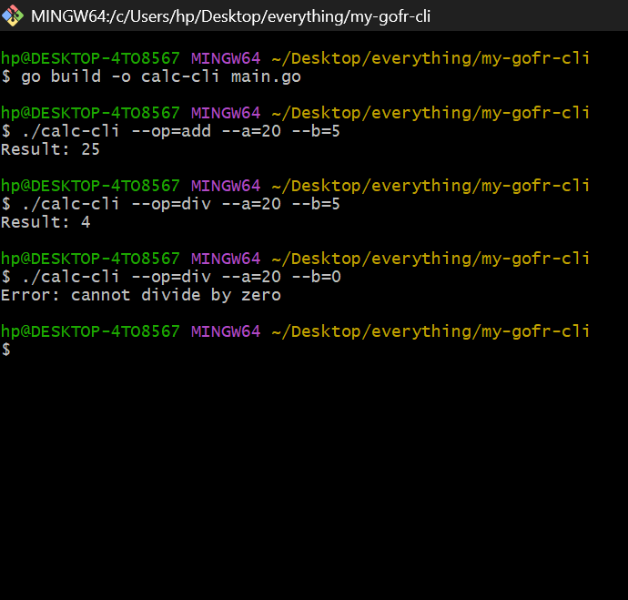

# GoFr CLI Documentation

GoFr supports building command-line interface (CLI) applications using the same architecture as its web services. To enable CLI mode, initialize your application with gofr.NewCMD() instead of gofr.New(). This activates CLI-specific behavior, automatically configuring logging, configuration management, and context handling for command-line workflows.

 ---

## CLI Application Structure

- *Initialization:* Use gofr.NewCMD() to set up your CLI application.
- *Command Registration:* Define each CLI command with a name and a handler function.
- *Context:* Each command handler receives a context object for accessing configuration, logging, arguments, and environment variables.

 ---

## Logging

- *Output:* Logs are output to stdout by default.
- *Log Levels:* Supported levels include DEBUG, INFO, WARN, ERROR, and FATAL.
- *Configuration:* Set the log level using the environment variable LOG_LEVEL. Example values: DEBUG, INFO, ERROR.
- *Format:* Each log message includes a timestamp, level, and message content.
- *Customization:* By default, logs go to stdout. Advanced users can redirect logs using Go's logging configuration tools if required, though this is not necessary for standard usage.

 ---

## Configuration and Environment

- GoFr CLI applications accept configuration and environment variables the same way as its web framework mode.
- Common variables for CLI apps include LOG_LEVEL and GOFR_ENV.
- All configuration is accessible through the context provided to each command handler.

 ---

## Best Practices

- Register clear, descriptive command names for each CLI function.
- Use environment variables to manage configuration and logging.
- Prefer using the provided logger over direct output for consistency and structure.
- Structure commands with single-responsibility to simplify usage and maintenance.

 ---
 > **Note**  
> This document provides details about the **GoFr CLI**, a lightweight command-line utility built using the **GoFr framework itself**.  
> It serves as a practical example of how developers can leverage GoFr for building their own CLI applications.  
>  
> For existing reference documentation, see [GoFr CLI Docs](https://gofr.dev/docs/references/gofrcli).


 ## Sample CLI App in GoFr

Here's a simple yet useful CLI calculator built with GoFr. It supports operations like `add`, `sub`, `mul`, and `div`.

### Code Example

```go
package main

import (
    "errors"
    "flag"
    "fmt"
    "os"
    "strconv"

    "gofr.dev/pkg/gofr"
)

func main() {
    var cliMode bool
    flag.BoolVar(&cliMode, "cli", false, "Run in CLI mode")
    var op string
    var a, b int
    flag.StringVar(&op, "op", "", "Operation to perform (add|sub|mul|div)")
    flag.IntVar(&a, "a", 0, "First number")
    flag.IntVar(&b, "b", 0, "Second number")
    flag.Parse()

    if cliMode {
        // Run CLI logic
        if op == "" || a == 0 && b == 0 {
            flag.Usage()
            os.Exit(1)
        }
        result, err := calculate(op, a, b)
        if err != nil {
            fmt.Println("Error:", err)
            os.Exit(1)
        }
        fmt.Println("Result:", result)
        os.Exit(0)
    }

    // Otherwise, start the GoFr web app as usual
    app := gofr.New()
    app.GET("/calculate", CalculateHandler)
    app.Run()
}

func calculate(op string, a int, b int) (int, error) {
    switch op {
    case "add":
        return a + b, nil
    case "sub":
        return a - b, nil
    case "mul":
        return a * b, nil
    case "div":
        if b == 0 {
            return 0, errors.New("cannot divide by zero")
        }
        return a / b, nil
    default:
        return 0, fmt.Errorf("unknown operation: %s", op)
    }
}

func CalculateHandler(ctx *gofr.Context) (interface{}, error) {
    op := ctx.PathParam("op")
    a, _ := strconv.Atoi(ctx.PathParam("a"))
    b, _ := strconv.Atoi(ctx.PathParam("b"))
    return calculate(op, a, b)
}

```

 >  **Note:**

> Create the file: Save the above code in a file named `calculator.go`.  
>  
>  **Set Up Go:** Ensure Go is installed on your system:  
> ```bash
> go version
> ```  
>  
>  **Build the CLI App:**  
> Open terminal → navigate to the directory containing `calculator.go` → run:  
> ```bash
> go build -o calculator calculator.go
> ```  
> This creates an executable file named `calculator` (or `calculator.exe` on Windows).  
>  
>  **Run the CLI App:**  
> ```bash
> ./calculator calc add 4 6     # Output: Result: 10  
> ./calculator calc sub 10 3    # Output: Result: 7  
> ./calculator calc mul 3 5     # Output: Result: 15  
> ./calculator calc div 12 3    # Output: Result: 4
> ```

 <p><strong>Snippet of Running Calculator.go</strong></p>


 **Ending Note:**
   
> This CLI app demonstrates how to structure and run basic command-line utilities using Go. You can enhance it further by adding error handling, more operations, or using third-party CLI libraries like Cobra for advanced features.

>  **Did you know?**  
> The GoFr CLI itself is a utility built entirely using the **GoFr framework**.  
> This demonstrates how GoFr can be used not just for web services, but also for building powerful command-line tools.
